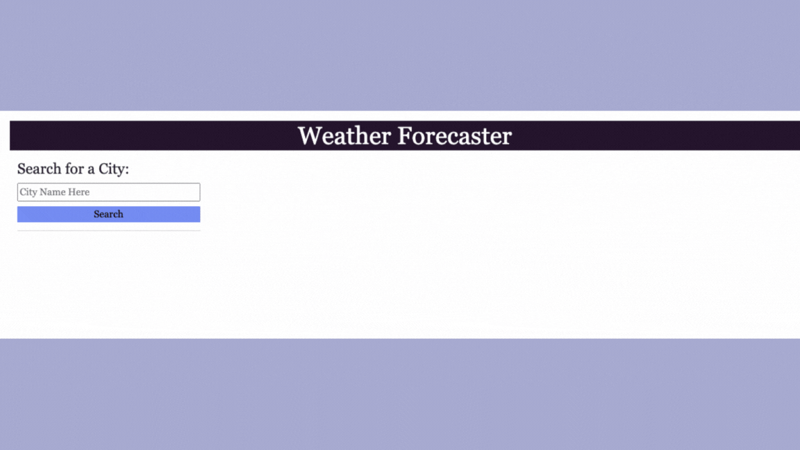

# Weather Forecaster

## Description

This website displays the current and 5-day weather forecast for cities around the world. There is a search bar where you can search for cities to see their forecast as well as an area for recent searches for you to constantly check on the weather in your favorite locations. 

## Installation

N/A

## Usage 

When you open up the websites you see an input field and a search button. Once you enter a city and search it then the current weather forecast including the date, weather icon, temperature, wind speed, and humidity appear in the box to the top right of the screen. Underneath that box there is the five-day forecast that displays the information above for that city over the next five days. Once you search for a city then a button is created for you to be able to easily see the weather forecast for that location by simply clicking on the button. 

## Credits 

For this website I used both the [5 Day Forecast API](https://openweathermap.org/forecast5) as well as the [Geocoding API](https://openweathermap.org/api/geocoding-api) to be able to utilize weather data on my webpage. 

## License

Please refer to the license in the repo. 

## Deployed Application
[Deployed Application](https://pbullock08.github.io/weather-forecaster/)
